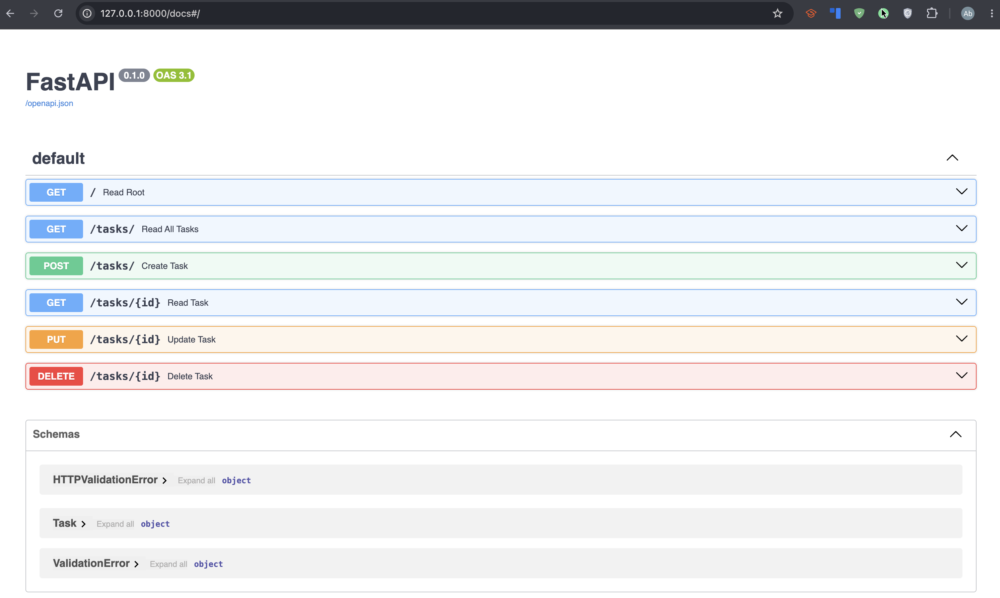

# sample_api

CRUD API project for week 1.

## Overview

This repository contains a simple API application that can be used as a starting point for development, testing, and experimentation.

## Features

- Basic CRUD API structure
- Easy to extend with new routes and handlers
- Suitable for local development

## Requirements

- Project dependencies installed
- A compatible runtime for the API implementation

## Getting Started

1. Clone the repository.
2. Install dependencies.
3. Start the application.

## Usage

Run the API locally and send requests to the available endpoints.

## Screenshot


```markdown

```

## CURL Output
```markdown
    curl -i http://localhost:8000/tasks/99
    HTTP/1.1 200 OK
    date: Sun, 26 Jul 2026 13:53:48 GMT
    server: uvicorn
    content-length: 70
    content-type: application/json
    {"status_code":404,"detail":{"error":"Task not found"},"headers":null}%     
```

